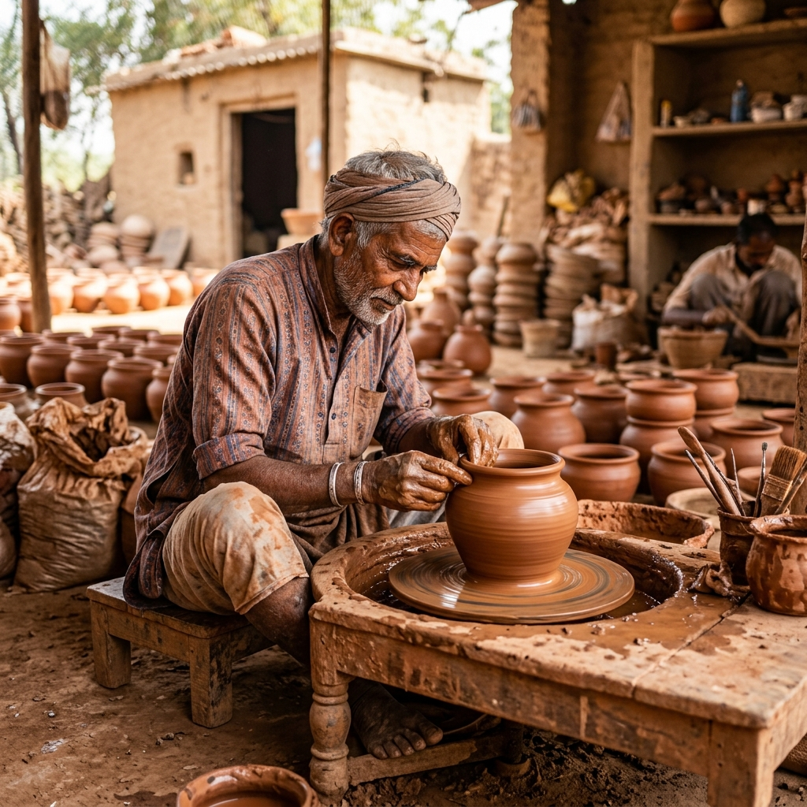
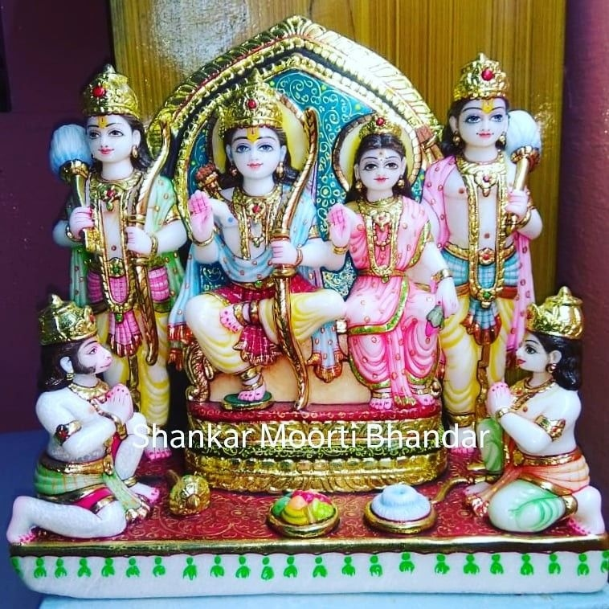
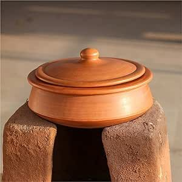
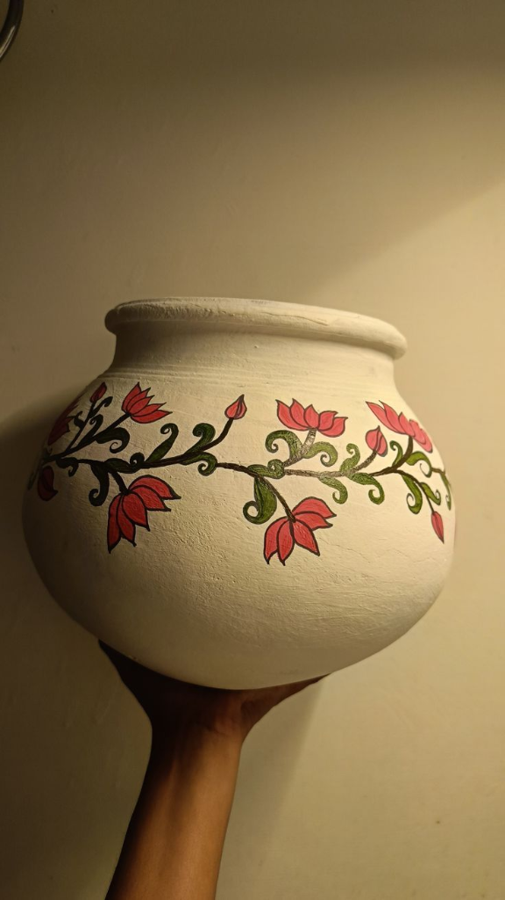
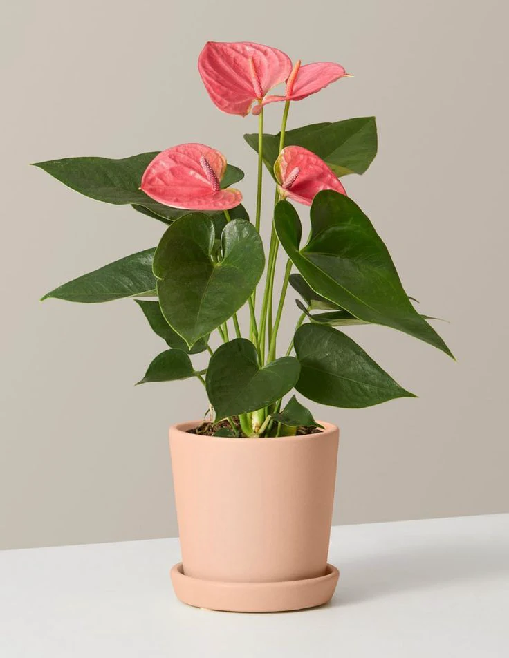
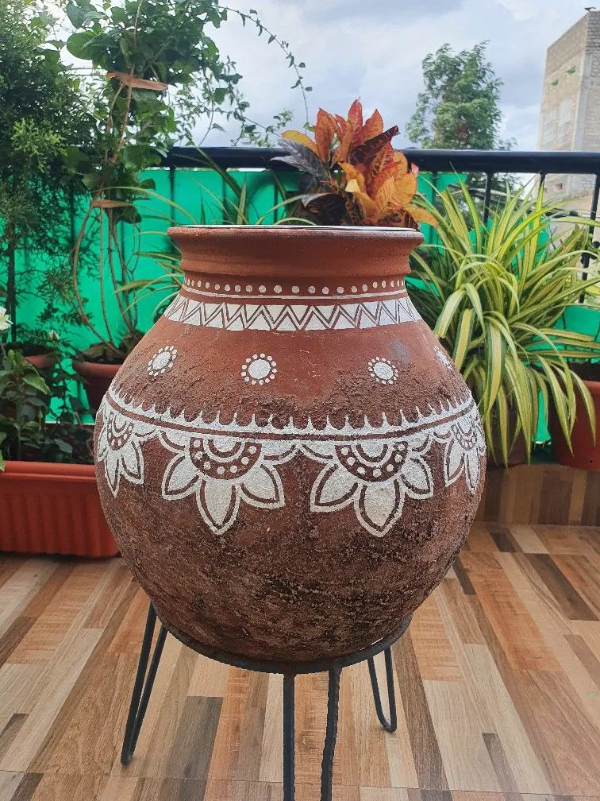
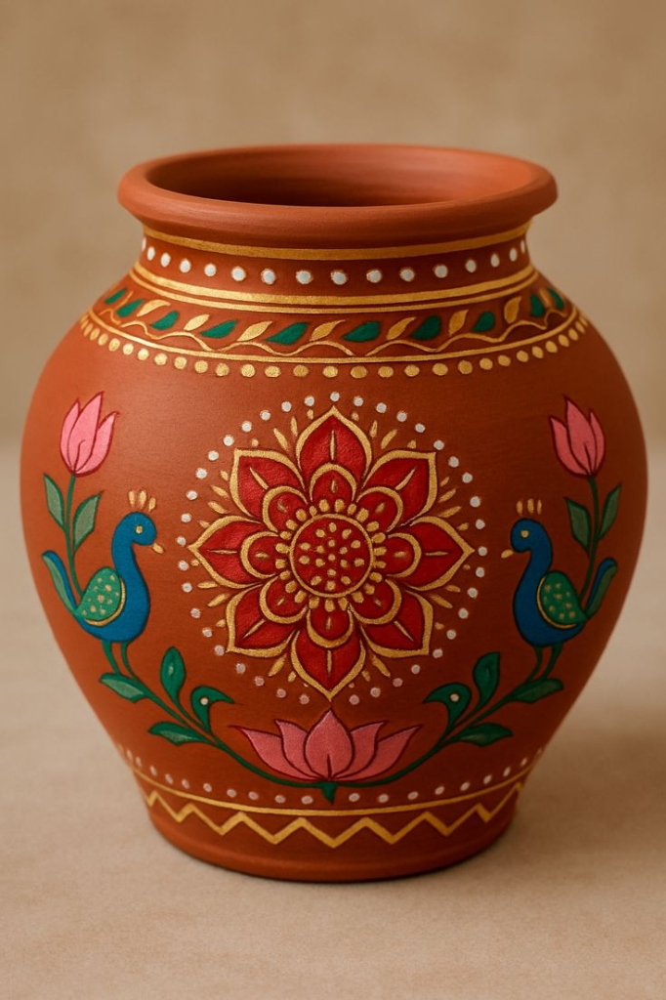

<p align="center">
  
</p>

<h1 align="center">🏺 प्रेम शंकर मूर्ति कला केंद्र</h1>
<h3 align="center">Prem Shankar Murti Kala Kendra</h3>
<p align="center">
  <em>Handcrafted Clay Pots · POP & Clay God Idols · Nursery Plants · Roadside Utility Shop</em>
</p>

<p align="center">
  
  
  
  
</p>

---

## 📖 About

**Prem Shankar Murti Kala Kendra** is a full-stack e-commerce website for a traditional Indian artisan studio & roadside shop founded by **Prem Shankar Prajapati** in 1994. The shop specializes in:

- 🍲 **Clay Utensils** — Handi, Kadai, Matka, Surahi, Kulhads (₹80 – ₹180)
- 🛕 **POP & Clay God/Devi Idols** — Ram Darbar, Durga Mata, Ganesha, Shivlinga (₹80 – ₹200)
- 🪷 **Decorative Flower Pots & Vases** — Mandala pots, peacock & lotus vases (₹80 – ₹180)
- 🪴 **Nursery Plants** — Anthurium, Snake Plant, Tulsi, Money Plant (₹40 – ₹150)
- 🔥 **Roadside Utilities** — Portable gas stoves, 5kg mini cylinders, hose accessories

---

## ✨ Features

| Feature | Description |
|---|---|
| **Product Catalog** | 19 handcrafted items across 4 categories with real product photography, ratings & reviews |
| **Category Filtering** | Filter by Clay Utensils, God Idols, Flower Pots, or Plants & Utilities |
| **Full-Text Search** | Search products by name, material, or description |
| **Product Detail Pages** | Dedicated detail view with image gallery, specs, and order actions |
| **Shopping Cart** | Add-to-cart with quantity controls, persistent via `localStorage` |
| **Custom Order Studio** | Dynamic price estimator form for custom POP/clay idols with material, size & finish options |
| **WhatsApp Integration** | One-click WhatsApp inquiry for any product |
| **REST API Backend** | Node.js serverless functions for products, shop info, custom quotes & order management |
| **SPA Routing** | Hash-based client-side routing across 6 views |
| **Responsive Design** | Mobile-friendly layout with artisan-themed earth-tone aesthetics |
| **Vercel Deployment** | Production-ready configuration for Vercel serverless hosting |

---

## 🖼️ Screenshots

<table>
  <tr>
    <td align="center"><br /><sub>Shri Ram Darbar Set</sub></td>
    <td align="center"><br /><sub>Desi Mitti Ki Handi</sub></td>
    <td align="center"><br /><sub>White Lotus Earthen Pot</sub></td>
  </tr>
  <tr>
    <td align="center"><br /><sub>Pink Anthurium Plant</sub></td>
    <td align="center"><br /><sub>Mandala Pot with Stand</sub></td>
    <td align="center"><br /><sub>Peacock Terracotta Vase</sub></td>
  </tr>
</table>

---

## 🏗️ Tech Stack

| Layer | Technology |
|---|---|
| **Frontend** | Vanilla HTML5, CSS3, JavaScript (ES6+) |
| **Backend** | Node.js (zero-dependency HTTP server) |
| **Serverless** | Vercel Serverless Functions (`@vercel/node`) |
| **Data Store** | JSON flat-file database (`data/*.json`) |
| **Deployment** | Vercel |
| **State Management** | `localStorage` for cart persistence |

---

## 📂 Project Structure

```
prem_shankar_murti_kala_kendra/
├── index.html              # Main SPA entry (6 views: Home, Catalog, Detail, Roadside, Custom Order, About)
├── style.css               # Complete design system with earth-tone artisan theme
├── script.js               # Frontend app logic (routing, catalog, cart, search, custom order estimator)
├── server.js               # Zero-dependency Node.js backend server (local development)
├── package.json            # Project metadata
├── vercel.json             # Vercel deployment & route configuration
├── .gitignore
│
├── api/                    # Vercel Serverless API Functions
│   ├── products.js         # GET  /api/products — returns product catalog
│   ├── shop-info.js        # GET  /api/shop-info — returns shop metadata
│   ├── custom-quote.js     # POST /api/custom-quote — logs custom order requests
│   └── orders.js           # POST /api/orders — logs cart checkout orders
│
├── data/                   # JSON flat-file data store
│   ├── products.json       # Product catalog (19 items with images, specs, pricing)
│   ├── shop_info.json      # Shop metadata (name, owner, hours, contact, pricing summary)
│   ├── custom_quotes.json  # Logged custom order quote requests
│   └── orders.json         # Logged cart orders
│
└── assets/
    └── images/             # 18 product & shop photographs (PNG/JPG)
        ├── artisan_hero.png
        ├── god_ram_darbar.jpg
        ├── clay_handi_chulha.png
        ├── pot_mandala_stand.jpg
        └── ... (14 more)
```

---

## 🚀 Getting Started

### Prerequisites

- [Node.js](https://nodejs.org/) v14+ (for local development server)
- [Vercel CLI](https://vercel.com/docs/cli) (optional, for deployment)

### Run Locally

```bash
# Clone the repository
git clone https://github.com/Kriti-G14/prem_shankar_murti_kala_kendra.git
cd prem_shankar_murti_kala_kendra

# Start the local development server
node server.js
```

The server starts at **http://localhost:3000** with these API endpoints:

| Method | Endpoint | Description |
|---|---|---|
| `GET` | `/api/products` | Fetch all products |
| `GET` | `/api/shop-info` | Fetch shop metadata |
| `POST` | `/api/custom-quote` | Submit a custom order quote request |
| `POST` | `/api/orders` | Submit a cart checkout order |
| `GET` | `/api/custom-quotes` | View all logged quote requests |
| `GET` | `/api/orders` | View all logged orders |

### Deploy to Vercel

```bash
# Install Vercel CLI (if not already installed)
npm i -g vercel

# Deploy
vercel
```

The project includes a pre-configured [`vercel.json`](vercel.json) that maps serverless functions and static assets automatically.

---

## 🎨 Design System

The website uses a warm **earth-tone artisan palette** inspired by traditional Indian pottery:

| Token | Color | Usage |
|---|---|---|
| `--primary-terracotta` | `#C85A32` | Primary accent, buttons, badges |
| `--ochre-gold` | `#DAA520` | Gold accents, premium highlights |
| `--leaf-green` | `#2E7D32` | Plant badges, availability indicators |
| `--earth-dark` | `#3E2723` | Headings, primary text |
| `--canvas-bg` | `#FFFDF9` | Page background |
| `--plaster-white` | `#FFF8F0` | Card backgrounds, borders |

Typography uses a serif/sans-serif combination for an artisan-meets-modern feel.

---

## 📦 Product Categories

### 🍲 Clay Utensils (₹80 – ₹180)
Handi, Kadai, Matka, Earthenware Collection, Kulhad Set — all kiln-fired terracotta.

### 🛕 POP & Clay God Idols (₹80 – ₹200)
Ram Darbar, Durga Mata, Ram-Sita-Lakshman Trio, Ganesha, Shivlinga — hand-painted with gold accents.

### 🪷 Flower Pots & Vases (₹80 – ₹180)
Mandala pots with iron stands, lotus vases, peacock terracotta vases, stacked planters.

### 🪴 Nursery Plants & Utilities (₹40 – ₹150)
Pink Anthurium, Dieffenbachia, Snake Plant, Holy Tulsi, Money Plant — all in clay pots.

---

## 🤝 Contributing

Contributions are welcome! If you'd like to improve this project:

1. Fork the repository
2. Create a feature branch (`git checkout -b feature/amazing-feature`)
3. Commit your changes (`git commit -m 'Add amazing feature'`)
4. Push to the branch (`git push origin feature/amazing-feature`)
5. Open a Pull Request

---

## 📄 License

This project is open source and available under the [MIT License](LICENSE).

---

<p align="center">
  <strong>🪔 Crafted with traditional clay & Plaster of Paris devotion</strong><br />
  <em>© 2026 Prem Shankar Murti Kala Kendra. All Rights Reserved.</em>
</p>
